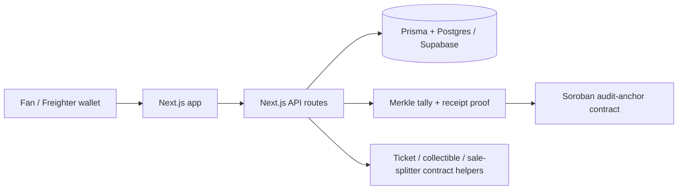

# CrownFi

CrownFi is a hackathon/testnet MVP for pageant voting, ticketing, fan rewards, contestant support, and digital collectibles. The current mainline app is a **Next.js full-stack demo**: the UI and API routes live in `web/`, data is handled through Prisma/Postgres, and Stellar/Soroban is used for audit proofs and asset/payment primitives where configured.

> **Status:** hackathon MVP. This repository is suitable for demos, review, and iteration. It is **not** production-ready voting infrastructure, mainnet financial infrastructure, or a replacement for legal tabulation/compliance systems.

Official testnet deployment: [stellar-crown-fi-ap-jr77.vercel.app](https://stellar-crown-fi-ap-jr77.vercel.app/). CrownFi never asks for a recovery phrase, seed phrase, or private key. Review the public [security policy](SECURITY.md), the deployed [wallet-safety page](https://stellar-crown-fi-ap-jr77.vercel.app/security), and the [false-positive remediation record](docs/security/phishing-false-positive-remediation.md) before connecting a wallet.

## What's new in the finale build (merged to `main`)

Beyond the mainline voting/ticketing/collectibles, this build adds:

- **Prediction markets** — Polymarket-style pooled markets on pageant outcomes (or any topic via a "General" category). Any connected user *or* admin can create a market with per-outcome inputs; fans stake USDC, **cancel positions** before close, and **claim** a pro-rata share of the pool. A **2% fee on winnings only** goes to a treasury. Includes a live **odds-over-time chart** and a **tabular outcomes** view (Chance / Pool / To-win).
- **Reusable pageant NFT contract (`pageant-nft`)** — one instance per pageant, **per-candidate IPFS metadata** (Pinata), effectively unlimited supply, **one mint per wallet**, and **admin-signed minting** so buyers sign only the payment. In-app **NFT gallery** on `/me` (token id + art + explorer link).
- **Per-category voting & leaderboards** — each pageant stage (Top 20 Swimsuit, Top 10 Long Gown, Top 5 Q&A, Overall Winner) is its **own round with its own tally** and per-category candidate photos (`web/public/candidates/<stage>/`). The leaderboard has **Swimsuit / Long Gown / Overall** boards; closed rounds use the anchored tally. The Vote tab shows the wallet's **existing vote** as locked-in.
- **Organizer submissions** — organizers register a pageant, add candidates with photos, and link a **Google Drive folder** of required files (permits, roster, hi-res photos); admins preview everything in the review modal.
- **UX** — gold design system (molten-gold buttons, cards and step chips), looping delegates filmstrip, mobile burger nav, sticky market filters, browser-side image auto-optimization, and a **Privy (email/Google) Web2 login** path alongside Freighter. (A night-mode theme exists but is currently hidden — see the note in `web/src/app/layout.tsx`.)
- **Payments admin** — master enable/disable, **maintenance mode**, and a scaffolded **GCash (via PayMongo)** checkout path (disabled until keys are set).
- **Performance** — in-memory TTL caches on both the client (`web/src/lib/api.ts`) and the hot read APIs (`web/src/lib/serverCache.ts`), so tab navigation doesn't re-hit Postgres.

### Deployed testnet contracts (updated 2026-09)

The current and legacy Soroban contracts are deployed on Stellar testnet:

| Contract | Purpose | ID |
|---|---|---|
| Audit anchor | Seals each closed round's Merkle root (tamper-evident tallies) | `CAC7AX3PFJ5NC43BB5TRWY4QTKLSPBVK3DT5GTLH5N6Y3TIYK5GLOVNV` |
| Ticket | Event tickets as verifiable passes (tier + seat) | `CA7M6UH55Z4UBQKBZNZBFFU3PWI3XI3BH46LMHSUINWJHTRG7CYDLH6N` |
| Collectible | Original contestant collectible primitive (mainline) | `CAZOOO3AUNGKDE6XTQNHETSBJGU33I2OCNREZ63GTUTDRPYBUS2R4LZX` |
| Sale splitter | On-chain USDC payment split; ticket listings **101–104** (Silver/Gold/Diamond/Platinum) registered | `CATCOIVWAVVXBNLPOXBVN3WQ26UNAVLUVSRYBNQWIII75I5QK4YV2KU3` |
| Test USDC | Mintable demo token everything settles in (faucet source) | `CAE2GXXU4BPLRX5DHLFJKUR7AP5ETPIERGTFNCY7PEFCEL5H3G3RG6LW` |
| Pageant NFT | Finale-build candidate NFTs: per-candidate IPFS metadata, one mint per wallet, admin-signed mint | `CCONZKTIQHR5UE4AKROICICZ2JSWDAXYBNYDCKDIMRFSIK37PND5PMQW` |
| Prediction market V1 — legacy | Original pooled markets. Kept only for existing positions and participant-signed refunds | `CDF3R2LUIZJUXCFUBXP62F25M2BYUJT6OT3QYR46MWWBUFEXEAY25POO` |
| Prediction market V2 — current | New pooled markets plus safe admin-assisted refunds to each original staker during force deletion | `CATV2RPFRMSVMBEJSXQ4SREUOHZ45WJ2F657IQMVYH3CFKB5XZPBVVX7` |

The prediction **treasury** (fee recipient) is a regular wallet, not a contract: `GC3PXGAWQWHHV6M6AKR3LSZZ7RNYZXASGNJM7BSU3EMWI5KG2R5QSIY3`.

Runbooks: [`contracts/DeploySC.md`](contracts/DeploySC.md) (deploy/init), [`docs/setup/deploy-nft-5-contestants.md`](docs/setup/deploy-nft-5-contestants.md) (Pinata + NFT), and the GCash steps in the PR description.

## Mainline architecture

The current mainline branch is intentionally simple so the team can demo it quickly:



Important framing:

- Voting is **backend-first/off-chain** for speed and privacy.
- Stellar is used for **tamper-evident audit commitments, payments, ticket/collectible primitives, and proof records**.
- CrownFi does **not** put every raw vote on-chain.
- Fan support, ticket purchases, and collectibles do **not** multiply vote power.
- Ticketing can reduce counterfeits and improve verifiable ownership, but it does **not** fully eliminate off-platform scalping.

## Repository layout

```text
.
├── web/                    # Active Next.js 15 app: UI, API routes, Prisma, wallet flows
├── contracts/              # Soroban Rust workspace: audit anchor, tickets, collectibles, sale splitter, test USDC
├── docs/                   # Structured project documentation
│   ├── overview/           # Product overview and hackathon pitch
│   ├── architecture/       # Current platform, component boundaries, future refactor plan
│   ├── features/           # Voting, ticketing, verification, admin, collectibles
│   ├── blockchain/         # Stellar/Soroban and transaction verification notes
│   ├── setup/              # Supabase, local setup, deployment notes
│   ├── security/           # Security audit notes
│   └── planning/           # Refactor TODOs
├── SECURITY.md             # Root security policy and reporting notes
├── SUPABASE.md             # Compatibility pointer to Supabase setup docs
├── USER_FLOW.md            # Compatibility pointer to demo walkthrough
├── WORKFLOW.md             # Compatibility pointer to workflow docs
└── DEPLOY.md               # Compatibility pointer to deployment docs
```

> The Rust/Axum API and Docker Compose platform split are **future/refactor work**, not the active mainline runtime. See `docs/architecture/platform-refactor-plan.md` for that plan.

## Stack in mainline

| Area | Current implementation |
|---|---|
| Web app | Next.js 15 App Router, React 19, TypeScript, Tailwind CSS |
| API/backend | Next.js route handlers under `web/src/app/api` |
| Database | Prisma + Postgres; Supabase is the team-supported hosted Postgres path |
| Wallet | Freighter extension on desktop, Freighter Mobile through WalletConnect, and Privy Google/email |
| Blockchain | Stellar Testnet + Soroban Rust contracts where `STELLAR_MODE=live` is configured |
| Contracts | `audit-anchor`, `ticket`, `collectible`, `sale-splitter`, `usdc-test`, `pageant-nft`, `prediction-market` |
| CI/security | npm audit, TypeScript, Merkle tests, Rust format/tests/audit, secret smoke test, best-effort CodeQL |

## What the app currently does

### Fan flows

- Browse the pageant demo experience.
- Connect or create a fan session.
- Vote for a contestant in an open round.
- View receipt/proof information after a round is closed.
- Buy or mint demo tickets.
- View ticket voucher/check-in flows.
- Collect contestant memorabilia in demo/testnet mode.

### Admin flows

- Sign in through wallet-signed admin challenge flow.
- Create/manage contestants and rounds.
- Close rounds and generate tally snapshots.
- Anchor voting proofs in mock mode or Stellar/Soroban live mode when contract IDs are configured.
- Review organizer/admin-facing dashboard data.

### Voting/proof flow

1. A fan submits a vote through the web app.
2. The API route validates the round and duplicate-vote rules.
3. Prisma writes the vote to Postgres.
4. The database/application layer prevents duplicate votes per fan/round.
5. On close, the app computes a tally hash and Merkle root.
6. The proof is stored locally and can be anchored to Soroban when live mode is configured.
7. The verification page displays proof metadata without putting voter personal data on-chain.

## Quick start

### Requirements

- Node.js 22+ recommended, or the version used by CI.
- npm.
- A Postgres database. Supabase is supported because the current team setup uses it.
- Rust toolchain only if running Soroban contract checks.

### Web app setup

```bash
cd web
cp .env.example .env
npm ci
npx prisma migrate dev --name init
npm run seed
npm run dev
```

Open:

```text
http://localhost:3000
```

For Supabase/Postgres, configure `web/.env`:

```env
DATABASE_URL="postgresql://...pooler.supabase.com:6543/postgres?pgbouncer=true"
DIRECT_URL="postgresql://...pooler.supabase.com:5432/postgres"
```

> Local-only note: for a long-running `npm run dev` server, the direct `5432` URL is ~3.5× faster
> per query than the pooler. On Vercel (serverless) you **must** use the pooled `6543` URL above,
> or concurrent functions will exhaust the database's connections.

## Deploy to Vercel

1. **Import the repo** and set **Root Directory = `web`** (the app is not at the repo root).
   The build command is the default `npm run build` (it runs `prisma generate` first).
2. **Set the function region to Tokyo (`hnd1`)** — Project → Settings → Functions. The Supabase
   database is in `ap-northeast-1`; leaving functions in the default US East adds ~150–200 ms to
   every query.
3. **Environment variables** — copy every key from `web/.env.example` into Vercel and fill in the
   values from your local `web/.env`, with two changes:
   - `DATABASE_URL` → the **pooled 6543** URL with `?pgbouncer=true` (see note above).
   - `NEXT_PUBLIC_APP_ORIGIN` → your Vercel URL (e.g. `https://crownfi.vercel.app`).
4. **Do not run migrations from Vercel.** Apply schema changes locally with
   `npx prisma db push` / `prisma migrate deploy` against `DIRECT_URL`; the deployed app only reads.
5. After the first deploy, click through one paid flow (faucet → buy a Silver ticket) — Stellar
   testnet calls and the database are shared with local dev, so no reseeding is needed.

### Privy Google sign-in

The app needs `NEXT_PUBLIC_PRIVY_APP_ID`, `PRIVY_APP_ID`, and `PRIVY_APP_SECRET` in Vercel. Google
OAuth itself is enabled in the Privy dashboard rather than with another Vercel variable:

1. In **Privy → Login methods → Socials**, enable Google. Privy's shared Google credentials are
   suitable for testing; use your own Google OAuth web client before a production launch.
2. In **Privy → App settings → Domains**, add the exact production origin, for example
   `https://stellar-crown-fi-ap-jr77.vercel.app`. Do not add a wildcard Vercel domain.
3. If the app uses an OAuth redirect allowlist, add the exact HTTPS return URL used by the app.
   With custom Google credentials, register `https://auth.privy.io/api/v1/oauth/callback` as an
   authorized redirect URI in Google Cloud.
4. Test Google sign-in in Chrome or another normal browser. Google may block OAuth inside embedded
   or in-app browsers even when the integration is configured correctly.

Use [`docs/setup/supabase.md`](docs/setup/supabase.md) for the team’s Supabase path. A self-hosted Postgres instance can also work as long as the Prisma connection strings are set correctly.

## Environment variables

The main environment file is `web/.env`. Start from `web/.env.example`.

### Database

| Variable | Purpose |
|---|---|
| `DATABASE_URL` | Pooled/runtime Postgres connection for the app |
| `DIRECT_URL` | Direct Postgres connection for Prisma migrations |

### App/wallet mode

| Variable | Purpose |
|---|---|
| `WALLET_PROVIDER` | `mock` by default; future embedded-wallet adapters may be added later |
| `STELLAR_MODE` | `mock` by default; use `live` only after contract deployment/configuration |
| `STELLAR_NETWORK` | Usually `testnet` during the hackathon/demo phase |
| `STELLAR_RPC_URL` | Soroban RPC endpoint |
| `NEXT_PUBLIC_STELLAR_NETWORK` | Client-visible Stellar network label |
| `NEXT_PUBLIC_STELLAR_NETWORK_PASSPHRASE` | Client-visible Stellar network passphrase |
| `NEXT_PUBLIC_WALLETCONNECT_PROJECT_ID` | Reown project ID required for Freighter Mobile on iPhone/Android |

### Admin authentication

| Variable | Purpose |
|---|---|
| `ADMIN_WALLETS` | Server-side comma-separated allowlist of admin `G...` addresses |
| `NEXT_PUBLIC_ADMIN_WALLETS` | Client UI hint only; not a security boundary |
| `ADMIN_SESSION_SECRET` | HMAC secret for httpOnly admin session cookies |
| `NEXT_PUBLIC_APP_ORIGIN` | Optional app origin used in challenge text |

Generate a strong admin session secret with:

```bash
openssl rand -base64 32
```

### Stellar contract IDs

When using `STELLAR_MODE=live`, set deployed Soroban contract IDs:

| Variable | Purpose |
|---|---|
| `AUDIT_ANCHOR_CONTRACT_ID` | Round Merkle/tally anchor contract |
| `TICKET_CONTRACT_ID` | Ticket contract |
| `COLLECTIBLE_CONTRACT_ID` | Collectible contract |
| `SALE_SPLITTER_CONTRACT_ID` | Listing/payment split contract |
| `USDC_TEST_CONTRACT_ID` | Demo/test USDC contract |
| `PAGEANT_NFT_CONTRACT_ID` | Reusable per-candidate NFT contract (`pageant-nft`) |
| `PREDICTION_MARKET_CONTRACT_ID` | Prediction-market escrow/settlement contract |
| `PREDICTION_MARKET_CONTRACT_ID_V2` | Current prediction contract with admin-assisted refunds; new markets use this ID |
| `PREDICTION_MARKET_TREASURY` | Wallet that receives the 2% market fee |
| `STELLAR_PLATFORM_SECRET` | Server-only platform signing key for platform-authorized operations |
| `DEMO_CONTESTANT_PAYOUT` | Demo payout wallet used by listing registration scripts |

Optional (fiat): `PAYMONGO_SECRET_KEY`, `PAYMONGO_PUBLIC_KEY`, `PAYMONGO_WEBHOOK_SECRET`, `PHP_PER_USD` enable the GCash checkout. Leave blank to keep it disabled.

Do not commit `.env`, private keys, seed phrases, database passwords, Supabase service-role keys, or Stellar secret keys.

## Smart contracts

Contracts live in [`contracts/`](contracts/).

```text
contracts/
├── audit-anchor/       # voting round checkpoints / Merkle roots
├── ticket/             # ticket asset primitive
├── collectible/        # contestant collectible primitive (mainline)
├── sale-splitter/      # listing-based payment split primitive
├── usdc-test/          # mintable test token for demos
├── pageant-nft/        # finale build: per-candidate NFTs (IPFS metadata, 1 mint/wallet)
└── prediction-market/  # finale build: pooled prediction markets (stake/unstake/claim)
```

### Contract checks

```bash
cd contracts
cargo fmt --all -- --check
cargo test --workspace --locked
cargo audit
```

`cargo audit --deny warnings` may report advisory warnings from transitive Soroban/Arkworks dependencies. These are documented in [`docs/security/security-audit.md`](docs/security/security-audit.md) and are kept visible but non-blocking in CI.

### Testnet deployment

Install the toolchain:

```bash
rustup target add wasm32v1-none
cargo install --locked stellar-cli
```

Generate and fund a testnet identity:

```bash
stellar keys generate alice --network testnet --fund
```

Build contracts:

```bash
cd contracts
stellar contract build
```

Use [`contracts/DEPLOY_GUIDE.md`](contracts/DEPLOY_GUIDE.md) for the full deployment runbook and contract wiring steps.

## Demo flow

A minimal reviewer/demo path:

1. Start the app.
2. Connect/create a fan account.
3. Vote for a contestant.
4. Sign in as admin using an allowlisted Stellar wallet.
5. Create or close a voting round.
6. Anchor the round result in mock mode or live testnet mode.
7. Verify a vote receipt against the Merkle root.
8. Try ticket and collectible flows in mock/testnet mode.

See [`docs/demo/user-flow.md`](docs/demo/user-flow.md) for the longer walkthrough.

## Security posture

The mainline includes an MVP security hardening pass that is appropriate for a hackathon/testnet demo, not production use.

Current hardening includes:

- server-side wallet-signed admin sessions;
- server-side wallet-signed fan sessions and Privy access-token verification;
- httpOnly admin session cookies;
- server-side checks on sensitive admin routes;
- short-lived transaction intents for signed XDR confirmation;
- exact, server-origin-bound wallet challenge verification;
- same-origin enforcement for browser API mutations and signed PayMongo webhook verification;
- strict security headers, constrained uploads, and a published security contact;
- live-mode rejection for direct mock mint endpoints;
- faucet rate/amount limits;
- dependency audit cleanup;
- committed-secret smoke tests;
- removal of local/generated artifacts from version control.

Known limitations:

- payment and mint are not fully atomic yet;
- in-memory challenges, sessions, rate limits, and transaction intents are demo/server-singleton only;
- contract IDs and live-mode configuration need final testnet validation before presenting live Stellar flows;
- a deeper external review is required before any mainnet, real-money, or real voter-data usage.

See [`SECURITY.md`](SECURITY.md) and [`docs/security/security-audit.md`](docs/security/security-audit.md).

## CI and local validation

Run these before pushing or asking for review:

```bash
cd web
npm ci
npm audit --audit-level=moderate
npm audit --audit-level=moderate --omit=dev
npm run typecheck
npm run test:merkle
npm run test:security
```

```bash
cd contracts
cargo fmt --all -- --check
cargo test --workspace --locked
cargo audit
```

Optional advisory visibility check:

```bash
cd contracts
cargo audit --deny warnings
```

GitHub Actions run checks that avoid requiring special repository permissions. CodeQL is best-effort because this repository may not have GitHub Code Scanning/GitHub Advanced Security enabled.

## Useful docs

| Document | Purpose |
|---|---|
| [`docs/README.md`](docs/README.md) | Documentation map |
| [`docs/DEMO_QA.md`](docs/DEMO_QA.md) | Q&A prep — likely judge/investor questions with our answers |
| [`docs/overview/hackathon-pitch.md`](docs/overview/hackathon-pitch.md) | Hackathon/project narrative |
| [`docs/architecture/current-platform.md`](docs/architecture/current-platform.md) | Current mainline architecture |
| [`docs/features/voting.md`](docs/features/voting.md) | Voting flow and constraints |
| [`docs/features/ticketing.md`](docs/features/ticketing.md) | Ticketing flow and anti-scalping framing |
| [`docs/features/verification.md`](docs/features/verification.md) | Audit/proof verification flow |
| [`docs/blockchain/stellar-soroban.md`](docs/blockchain/stellar-soroban.md) | Stellar/Soroban integration notes |
| [`docs/blockchain/transaction-verification.md`](docs/blockchain/transaction-verification.md) | How transaction/proof verification should be presented |
| [`docs/setup/supabase.md`](docs/setup/supabase.md) | Supabase/Postgres setup |
| [`docs/security/security-audit.md`](docs/security/security-audit.md) | Security audit notes and remaining risks |

## Roadmap

| Phase | When | What |
|---|---|---|
| **Shipped** | Now | Full testnet platform: 7 deployed contracts, anchored verifiable voting, prediction markets, NFTs, ticketing, Google/email onboarding with real wallets |
| **Next** | Q3 2026 | Pilot regional pageant runs a live anchored round · GCash live via PayMongo · external contract audit + multisig admin · Stellar Community Fund application |
| **Planned** | Q4 2026 | Staged mainnet (audit-anchor first, commerce after audit) · sponsored reserves · free-play predictions with loyalty points |
| **Planned** | 2027 | Licensed real-money markets (PAGCOR-compliant partner) · talent shows / esports / fan awards on the same rails · self-serve organizer platform |

## Socials

**X account:** [https://x.com/CrownFi_app]
